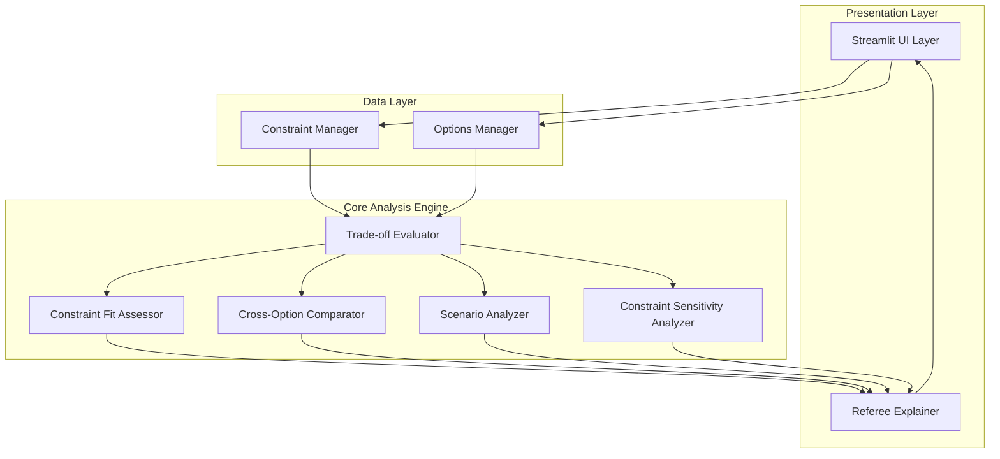

# Design Document

## Overview

The Referee is a constraint-driven decision-support tool that helps users compare technical options through comprehensive trade-off analysis. Rather than providing recommendations or rankings, it empowers informed decision-making by revealing the nuanced considerations that influence technical choices. The system uses qualitative assessment, cross-option comparison, and scenario-based analysis to provide objective insights without declaring winners.

The current implementation demonstrates this approach with a tech stack comparison tool that evaluates compute options (Serverless, Containers, VMs, PaaS) based on user constraints like budget, performance priorities, scale, team skill, and time-to-market requirements.

## Architecture

The Referee follows a modular, constraint-driven architecture with clear separation of concerns:



### Key Architectural Principles

1. **Constraint-Driven**: All analysis flows from user-defined constraints
2. **Modular Analysis**: Each analysis type (fit assessment, cross-comparison, scenarios) is isolated
3. **Qualitative Assessment**: No numeric scoring or ranking systems
4. **Extensible Options**: New technical options can be added without changing core logic
5. **Transparent Reasoning**: All analysis includes explicit reasoning and assumptions

## Components and Interfaces

### Constraint Manager
**Purpose**: Captures and structures user constraints
**Key Classes**: `Constraints`, `Budget`, `Performance`, `Scale`, `TeamSkill`, `TimeToMarket`

```python
@dataclass
class Constraints:
    budget: Budget
    performance: Performance
    scale: Scale
    team_skill: TeamSkill
    time_to_market: TimeToMarket
    
    def to_dict(self) -> Dict[str, str]
```

**Interface**: Provides structured constraint data to all analysis components

### Options Manager
**Purpose**: Defines available technical options with their characteristics
**Key Classes**: `TechOption`

```python
@dataclass
class TechOption:
    name: str
    category: str
    base_cost: str
    learning_curve: str
    scalability: str
    performance_profile: str
    setup_time: str
    operational_complexity: str
    description: str
```

**Interface**: Provides option metadata for constraint-aware evaluation

### Trade-off Evaluator
**Purpose**: Core analysis engine that evaluates options against constraints
**Key Class**: `TradeOffEvaluator`

```python
class TradeOffEvaluator:
    def evaluate_option(self, option: TechOption) -> Dict[str, List[str]]:
        # Returns: strengths, limitations, hidden_costs, when_not_to_choose
```

**Analysis Logic**:
- Budget-aware cost analysis
- Performance-constraint evaluation
- Scale-appropriate assessment
- Team skill consideration
- Time-to-market alignment

### Constraint Fit Assessor
**Purpose**: Provides qualitative fit assessment without numeric scoring
**Key Class**: `ConstraintFitAssessor`

```python
class ConstraintFitAssessor:
    def assess_fit(self, option_key: str) -> Tuple[str, str, str]:
        # Returns: fit_level, reasoning, context_warning
        # fit_level: "strong_fit" | "conditional_fit" | "risky_fit"
```

**Fit Levels**:
- **Strong Fit**: Option aligns well with current constraints
- **Conditional Fit**: Option works adequately with careful configuration
- **Risky Fit**: Option conflicts with constraints or requires significant assumptions

### Cross-Option Comparator
**Purpose**: Generates direct comparisons between options
**Key Class**: `CrossOptionComparator`

```python
class CrossOptionComparator:
    def generate_comparisons(self) -> List[str]:
        # Returns constraint-specific comparison statements
```

**Comparison Types**:
- Performance-based comparisons (latency vs throughput)
- Budget-based comparisons (cost structures)
- Scale-based comparisons (scaling characteristics)
- Team skill-based comparisons (complexity levels)

### Scenario Analyzer
**Purpose**: What-if analysis for changing conditions
**Key Class**: `ScenarioAnalyzer`

```python
class ScenarioAnalyzer:
    def analyze_scenario(self, scenario_type: str) -> Dict[str, str]:
        # Returns option-specific scenario analysis
```

**Supported Scenarios**:
- Traffic increases 10x
- Team size doubles
- Budget cuts 30%
- Latency becomes critical (<50ms)

### Constraint Sensitivity Analyzer
**Purpose**: Identifies which constraints most influence the decision
**Key Class**: `ConstraintSensitivityAnalyzer`

```python
class ConstraintSensitivityAnalyzer:
    def analyze_sensitivity(self) -> Dict[str, Tuple[str, str]]:
        # Returns: constraint -> (impact_level, explanation)
        # impact_level: "HIGH" | "MEDIUM" | "LOW"
```

### Referee Explainer
**Purpose**: Generates natural language insights and maintains neutrality
**Key Class**: `RefereeExplainer`

```python
class RefereeExplainer:
    def generate_referee_insight(self, evaluations: Dict) -> str:
        # Returns comprehensive insight without declaring winners
    
    def get_analysis_assumptions(self) -> List[str]:
        # Returns explicit assumptions underlying the analysis
```

## Data Models

### Constraint Enums
```python
class Budget(Enum):
    LOW = "low"
    MEDIUM = "medium"
    HIGH = "high"

class Performance(Enum):
    LATENCY = "latency"
    THROUGHPUT = "throughput"
    BALANCED = "balanced"

class Scale(Enum):
    SMALL = "small"
    MEDIUM = "medium"
    MASSIVE = "massive"

class TeamSkill(Enum):
    BEGINNER = "beginner"
    INTERMEDIATE = "intermediate"
    EXPERT = "expert"

class TimeToMarket(Enum):
    URGENT = "urgent"
    FLEXIBLE = "flexible"
```

### Analysis Results Structure
```python
{
    "option_key": {
        "option": TechOption,
        "analysis": {
            "strengths": List[str],
            "limitations": List[str],
            "hidden_costs": List[str],
            "when_not_to_choose": List[str]
        },
        "fit_assessment": {
            "fit_level": str,
            "reasoning": str,
            "context_warning": str
        }
    }
}
```

### Sensitivity Analysis Structure
```python
{
    "constraint_name": {
        "impact_level": "HIGH" | "MEDIUM" | "LOW",
        "explanation": str
    }
}
```

## Correctness Properties

*A property is a characteristic or behavior that should hold true across all valid executions of a system-essentially, a formal statement about what the system should do. Properties serve as the bridge between human-readable specifications and machine-verifiable correctness guarantees.*

### Property 1: Constraint-Driven Evaluation Completeness
*For any* valid constraint combination and option set, the evaluation engine should produce analysis for every option that includes all required constraint considerations.
**Validates: Requirements 1.1, 1.4, 1.5**

### Property 2: Comprehensive Option Analysis Structure
*For any* option evaluation, the analysis should include strengths, limitations, hidden costs, and "when not to choose" scenarios in a structured format.
**Validates: Requirements 2.1, 2.2, 2.3, 2.4, 2.5**

### Property 3: Cross-Option Comparative Analysis
*For any* set of options under given constraints, the comparison should highlight relative strengths, identify similarities, and show complementary relationships without declaring winners.
**Validates: Requirements 3.1, 3.2, 3.3, 3.4, 3.5**

### Property 4: Constraint Sensitivity and Scenario Analysis
*For any* constraint modification or scenario exploration, the system should show how assessments change while maintaining the original baseline evaluation unchanged.
**Validates: Requirements 4.1, 4.2, 4.3, 4.4, 4.5**

### Property 5: Qualitative Assessment Without Ranking
*For any* option assessment, the fit description should use qualitative language with contextual explanations and emphasize conditional nature without numeric scores or hierarchical rankings.
**Validates: Requirements 5.1, 5.2, 5.3, 5.4, 5.5**

### Property 6: Decision Support Without Recommendation
*For any* analysis output, the content should provide comprehensive considerations and highlight decision factors without making final recommendations or weighting relative importance.
**Validates: Requirements 6.1, 6.2, 6.3**

### Property 7: Structured Output Consistency
*For any* analysis presentation, the formatting should be consistent across all options with organized trade-off sections and support for both summary and detailed views.
**Validates: Requirements 7.1, 7.2, 7.3, 7.5**

### Property 8: Constraint Conflict Detection
*For any* constraint combination that creates competing priorities, the system should explicitly highlight the trade-offs between conflicting constraints.
**Validates: Requirements 1.3**

<function_calls>
<invoke name="prework">
<parameter name="featureName">the-referee

## Error Handling

### Input Validation
- **Constraint Validation**: All constraint enums must have valid values; invalid constraints should raise clear validation errors
- **Option Validation**: Technical options must have complete metadata; missing fields should be detected and reported
- **Scenario Validation**: What-if scenarios must be from supported set; unsupported scenarios should return empty results gracefully

### Analysis Robustness
- **Missing Data Handling**: If option metadata is incomplete, analysis should continue with available data and note limitations
- **Constraint Conflicts**: When constraints create impossible combinations, system should highlight conflicts rather than fail
- **Edge Case Handling**: Extreme constraint combinations (e.g., low budget + massive scale) should produce meaningful analysis

### User Experience
- **Graceful Degradation**: If specific analysis components fail, other components should continue working
- **Clear Error Messages**: Any errors should provide actionable guidance for resolution
- **Assumption Transparency**: When analysis makes assumptions due to missing data, these should be explicitly stated

## Testing Strategy

### Dual Testing Approach
The Referee requires both unit testing and property-based testing to ensure correctness:

**Unit Tests** focus on:
- Specific constraint combinations and their expected analysis outcomes
- Edge cases like extreme constraint values or conflicting requirements
- Integration between components (evaluator → assessor → explainer)
- Error conditions and graceful degradation
- UI component behavior and formatting

**Property-Based Tests** focus on:
- Universal properties that hold across all constraint combinations
- Structural consistency of analysis outputs
- Neutrality maintenance (no winner declarations)
- Comprehensive coverage through randomized constraint generation

### Property-Based Testing Configuration
- **Testing Library**: Hypothesis (Python) for property-based testing
- **Test Iterations**: Minimum 100 iterations per property test
- **Test Tagging**: Each property test references its design document property
- **Tag Format**: `# Feature: the-referee, Property {number}: {property_text}`

### Key Testing Areas

**Constraint Processing**:
- All valid constraint combinations produce complete evaluations
- Invalid constraints are handled gracefully
- Constraint changes trigger appropriate re-evaluation

**Analysis Completeness**:
- Every option evaluation includes all required sections (strengths, limitations, hidden costs, when not to choose)
- Cross-option comparisons maintain neutrality
- Scenario analysis preserves baseline evaluations

**Output Consistency**:
- All analysis outputs follow consistent structure
- Qualitative language is maintained (no numeric scores)
- Export functionality produces complete, structured results

**Neutrality Verification**:
- No option is declared "best", "winner", or ranked
- Language remains neutral and conditional
- Decision support empowers rather than replaces user judgment

### Integration Testing
- End-to-end workflow from constraint input to analysis export
- UI component integration with analysis engine
- Cross-component data flow validation
- Performance testing with large constraint/option combinations

The testing strategy ensures that The Referee maintains its core principles of neutrality, comprehensiveness, and user empowerment while providing reliable, consistent analysis across all use cases.